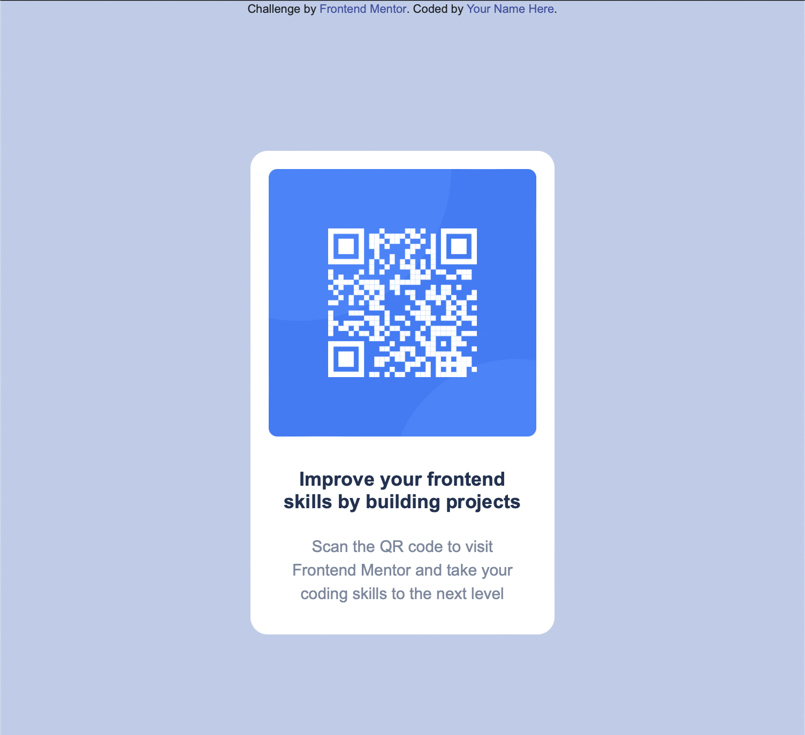

# Frontend Mentor - QR code component solution

This is a solution to the [QR code component challenge on Frontend Mentor](https://www.frontendmentor.io/challenges/qr-code-component-iux_sIO_H). Frontend Mentor challenges help you improve your coding skills by building realistic projects. 

## Overview

### Screenshot

### Links

- Live Site URL: (https://jvmcpheron.github.io/QR-code-component/)

## My process

### Built with

- Semantic HTML5 markup
- CSS 
- Mobile-first workflow

### What I learned

Figured out a new way to align a div vertically.

To see how you can add code snippets, see below:

## Author

- Website - [Jane](https://jvmcpheron.github.io/Bootstrap_Portfolio)
- Frontend Mentor - [@jvmcpheron](https://www.frontendmentor.io/profile/jvmcpheron)
- Github - [@jvmcpheron](https://github.com/jvmcpheron)
